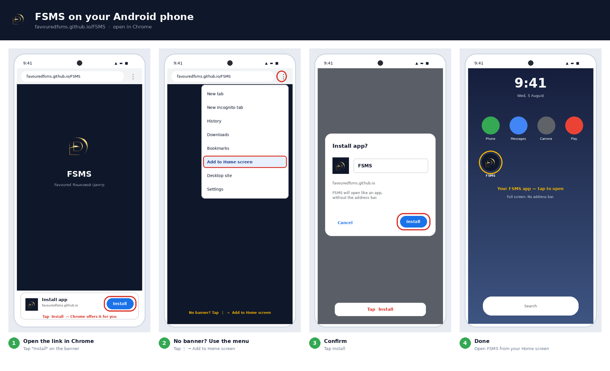

# Put FSMS on your Android phone

**Link:** https://favouredfsms.github.io/FSMS/

Send this page to your staff, parents and students. It takes about 20 seconds.

---



## Step 1 — Open the link in Chrome

Go to **favouredfsms.github.io/FSMS**

Chrome will offer it to you: a bar slides up at the bottom saying
**Install app**. Tap **Install**.

> On Android, Chrome asks *you* — you do not have to go looking for it. Give it
> a couple of seconds to appear.

## Step 2 — No banner? Use the menu

Some phones and some Chrome versions do not show the banner, and it does not
come back once dismissed. It is still one tap away:

Tap the **⋮** menu (top right) → **Add to Home screen** *(or **Install app**,
depending on your Chrome version).*

## Step 3 — Confirm

A small box appears with the name **FSMS**. Tap **Install**.

## Step 4 — Done

The FSMS icon is now on your Home screen. Open it from there — it fills the
whole screen with no address bar, exactly like an app from the Play Store.

---

## Other Android browsers

| Browser | Works? |
|---|---|
| **Chrome** | ✅ Recommended |
| **Samsung Internet** | ✅ Menu → *Add page to* → *Home screen* |
| **Microsoft Edge** | ✅ Menu → *Add to phone* |
| **Firefox** | ✅ Menu → *Install* |
| **Opera** | ✅ Menu → *Home screen* |

Any of these will work. Chrome is simply the one that offers it unprompted.

---

## What people get

| | |
|---|---|
| **Icon** | Your gold Favoured mark, in a circle |
| **Name** | FSMS |
| **On opening** | Your logo on a dark splash while it loads |
| **Then** | FSMS full screen, no address bar |

It also appears in the app drawer and in recent apps, like any installed app.

---

## If it does not work

| Problem | Fix |
|---|---|
| No banner appears | Use **⋮** → *Add to Home screen*. The banner only offers itself once. |
| No "Install app" in the menu | You are not on **https://**. Use the full `favouredfsms.github.io/FSMS` link, not a copied file. |
| It opens with an address bar | It was bookmarked rather than installed. Delete the icon and use *Install app*. |
| Blank white screen | Poor connection. Wait 6 seconds — a link appears to open it in the browser instead. |
| Signed out after installing | Normal the first time. Sign in once and it remembers. |
| Grey square instead of the logo | The icon files did not upload — see below. |

---

## ⚠️ One thing to fix on your site

I checked the live site while writing this. Android **does** install correctly
— I verified it: HTTPS ✓, manifest ✓, service worker ✓, installable icon ✓.

But the `icons` folder is still missing, so every icon file returns "not
found":

```
icons/icon-192.png     404
icons/icon-512.png     404
icons/maskable-192.png 404
```

Installing works anyway, because I embedded emergency copies of the icons
directly in the page. I have now also embedded the **splash image**, so the
launch screen shows your logo instead of a plain colour.

**To fix it properly** and get the sharpest artwork at every size:

1. Go to your **FSMS** repository on GitHub.
2. **Add file → Upload files**.
3. Open the `pwa` folder on your computer and drag in the **`icons` folder**.
4. **Commit changes**, then wait about a minute.
5. Re-upload **`pwa/manifest.webmanifest`** and **`pwa/index.html`** to pick up
   the latest fixes.

Then check that this shows your logo rather than a 404 page:
https://favouredfsms.github.io/FSMS/icons/icon-192.png

> Anyone who already installed FSMS should delete the icon and add it again to
> pick up the new artwork — phones cache home-screen icons aggressively.

---

## Using an iPhone instead?

See **[INSTALL-IPHONE.md](INSTALL-IPHONE.md)** — the steps are different, and
on iPhone it **must** be Safari.

## Using a computer?

See **[INSTALL-PC.md](INSTALL-PC.md)** — Chrome and Edge install it as a
proper desktop app with its own taskbar button.
