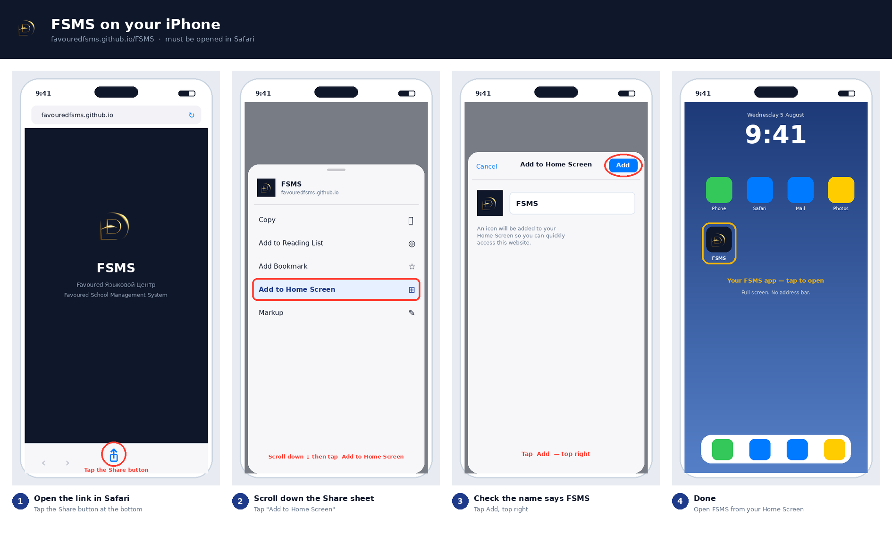

# Put FSMS on your phone

**Link:** https://favouredfsms.github.io/FSMS/

Send this page to your staff, parents and students. It takes about 30 seconds.

---

## iPhone & iPad



> ### ⚠️ It must be Safari
> iPhone only allows this from **Safari**. Chrome on iPhone has no "Add to
> Home Screen". If someone opens the link in Chrome, ask them to copy it into
> Safari first.

### Step 1 — Open the link in Safari

Go to **favouredfsms.github.io/FSMS**

Tap the **Share** button — the square with an arrow pointing up, at the bottom
of the screen.

*On an iPad it is at the top right instead.*

### Step 2 — Find "Add to Home Screen"

Scroll down the grey list that slides up. Tap **Add to Home Screen**.

### Step 3 — Tap Add

The name should already say **FSMS**. Tap **Add** in the top-right corner.

### Step 4 — Done

The FSMS icon is now on your Home Screen. Open it from there — it fills the
whole screen with no address bar, exactly like an app from the App Store.

---

## Android

Much simpler — **Chrome offers it to you.** There is an illustrated guide in
**[INSTALL-ANDROID.md](INSTALL-ANDROID.md)**, or the short version:

1. Open **favouredfsms.github.io/FSMS** in Chrome.
2. A banner appears at the bottom saying **Install app** — tap it.
3. If no banner appears, tap the **⋮** menu (top right) and choose
   **Install app** or **Add to Home screen**.
4. Tap **Install**.

---

## Computer (Chrome or Edge)

There is an illustrated guide in **[INSTALL-PC.md](INSTALL-PC.md)**, or the
short version:

Look for the small **install icon** at the right-hand end of the address bar —
a screen with a downward arrow. Click it, then **Install**. If there is no
icon: **⋮** → **Cast, save, and share** → **Install page as app**.

FSMS then opens in its own window, without browser tabs.

---

## What people get

| | |
|---|---|
| **Icon** | Your gold Favoured mark |
| **Name** | FSMS |
| **On opening** | Your logo on a dark splash while it loads |
| **Then** | FSMS full screen, no address bar |

---

## If it does not work

| Problem | Fix |
|---|---|
| No "Add to Home Screen" on iPhone | They are in Chrome. It must be **Safari**. |
| Nothing happens on Android | Use the **⋮** menu → *Install app*. Some phones do not show the banner. |
| Grey square instead of the logo | The icon files did not upload — see the note below. |
| Stuck on the splash screen | Wait 6 seconds; a link appears to open it in the browser instead. |
| Signed out after installing | Normal the first time. Sign in once and it remembers. |

---

## ⚠️ One thing to fix on your site

I checked your live site while writing this. **The `icons` folder did not
upload** — every icon returns "not found":

```
icons/apple-touch-icon.png   404
icons/icon-192.png           404
icons/icon-512.png           404
icons/splash-mark.png        404
```

Android still installs, because I had built an emergency copy of the icon into
the page itself. **iPhone was the problem**: iOS reads *only* the
`apple-touch-icon` file and ignores everything else, so an iPhone would have
put a **grey screenshot of the page** on the Home Screen instead of your logo.

I have now embedded the iPhone icon in the page too, so it works either way.

**To fix it properly and get the sharpest icons:**

1. Go to your `FSMS` repository on GitHub.
2. **Add file → Upload files**.
3. Open the `pwa` folder on your computer, and drag in the **`icons` folder**.
4. **Commit changes**, and wait about a minute.
5. Re-upload **`pwa/index.html`** as well, to pick up the iPhone fix.

Then check: https://favouredfsms.github.io/FSMS/icons/apple-touch-icon.png
should show your gold logo rather than a "404" page.

> Anyone who already installed FSMS should delete the icon and add it again to
> pick up the new artwork — phones cache home-screen icons aggressively.
