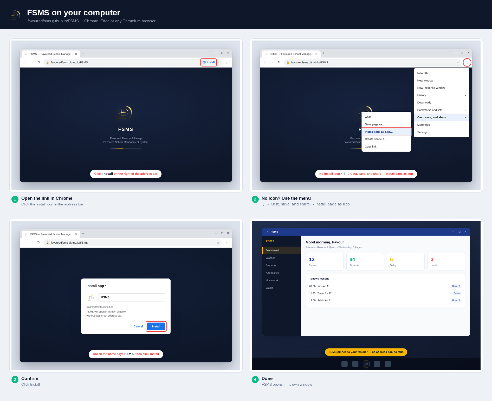

# Put FSMS on your computer

**Link:** https://favouredfsms.github.io/FSMS/

For office staff, accountants and anyone marking registers at a desk. Takes
about 20 seconds. Works on **Windows, Mac, Linux and Chromebook**.

---

## Step 1 — Open the link in Chrome

Go to **favouredfsms.github.io/FSMS**

Look at the **right-hand end of the address bar**. Chrome puts a small
**install icon** there — a monitor with a downward arrow. Click it.

> Unlike Android, the desktop browser does **not** slide a banner up at you.
> The icon is quiet and easy to miss. If you do not see it, go to Step 2.

## Step 2 — No icon? Use the menu

Click **⋮** (top right) → **Cast, save, and share** → **Install page as app…**

That is the current Chrome path. On older Chrome versions the item sits
directly on the main menu as **Install FSMS…** or under **More tools** →
**Create shortcut…** — any of them gets you there.

## Step 3 — Confirm

A small box appears. Check the name reads **FSMS**, then click **Install**.

## Step 4 — Done

FSMS opens in **its own window** — no tabs, no address bar, no bookmarks bar.
It behaves like any other installed program:

- **Windows** — pinned to the taskbar, and in the Start menu under **FSMS**
- **Mac** — appears in the **Applications** folder and in Launchpad; you can
  keep it in the Dock
- **Chromebook** — appears in the launcher

Close it and reopen it from there. You never have to type the address again.

---

## Other computer browsers

| Browser | How |
|---|---|
| **Chrome** | ✅ Address-bar icon, or ⋮ → *Cast, save, and share* → *Install page as app* |
| **Microsoft Edge** | ✅ Address-bar icon, or ⋯ → *Apps* → *Install this site as an app* |
| **Brave / Opera / Vivaldi** | ✅ Same as Chrome — they are all Chromium |
| **Safari (Mac)** | ✅ macOS Sonoma or newer: **File** → **Add to Dock** |
| **Firefox** | ❌ No install on desktop. Use a normal bookmark, or use Chrome/Edge |

Firefox is the one real gap. On Firefox, press **Ctrl + D** (**Cmd + D** on a
Mac) to bookmark the page instead — FSMS still works perfectly, it just lives
in a tab rather than its own window.

---

## Why bother, if it works in a tab anyway?

It does work in a tab. The installed version is nicer for daily desk work:

| | In a browser tab | Installed |
|---|---|---|
| **Opening it** | Find the tab among twenty others | One click on the taskbar |
| **Screen space** | Tabs + address bar + bookmarks eat ~120px | All of it is FSMS |
| **Closing by accident** | Easy — it is just another tab | Its own window |
| **Alt-Tab / Cmd-Tab** | Lands you on the whole browser | Lands you on FSMS |

For a secretary marking attendance all morning, the extra 120px and the
taskbar button are the whole point.

---

## Two useful extras

**Make it open when you log in** *(Windows, Chrome/Edge)*
Go to `chrome://apps` (or `edge://apps`), right-click **FSMS** → **Start app
when you sign in**. The office computer then has FSMS up before anyone sits
down.

**Remove it**
Open FSMS, click **⋮** in its title bar → **Uninstall FSMS**. This removes
only the shortcut — no school data is touched, ever. It all lives in Google
Sheets.

---

## If something goes wrong

| What you see | What it means |
|---|---|
| No install icon, and no menu item | You are on Firefox, or the page is not fully loaded — wait a second and retry |
| Menu item is greyed out | The page did not load over HTTPS — use the `github.io` link, not a saved file |
| It installed but opens a blank window | Your Apps Script deployment is not published to *Anyone*. See `FIX-MOBILE.md` |
| "Page not found" at the link | GitHub Pages is not serving the folder yet. See `PAGE-NOT-FOUND.md` |
| Installs, but the icon is a grey globe | The `icons` folder was never uploaded to the repo. See `README.md` |

---

## Sending this to people

> **Other devices:**
> **[iPhone](INSTALL-IPHONE.md)** · **[Android](INSTALL-ANDROID.md)** ·
> **PC (this page)**

The single image `guide/pc-install-guide.png` is self-contained — you can
paste it straight into an email or a WhatsApp group without this page.
